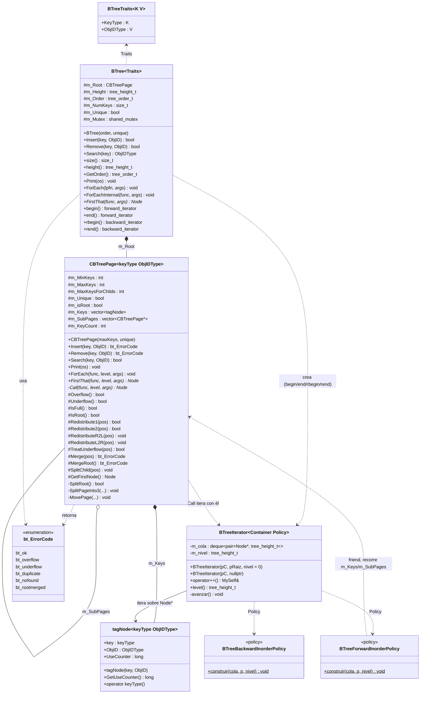
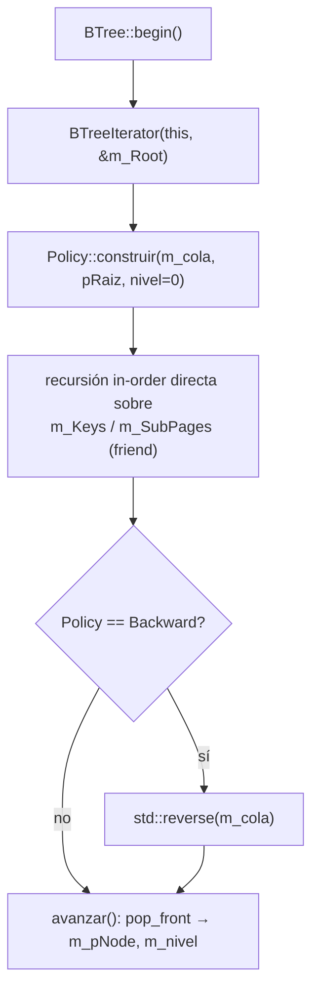
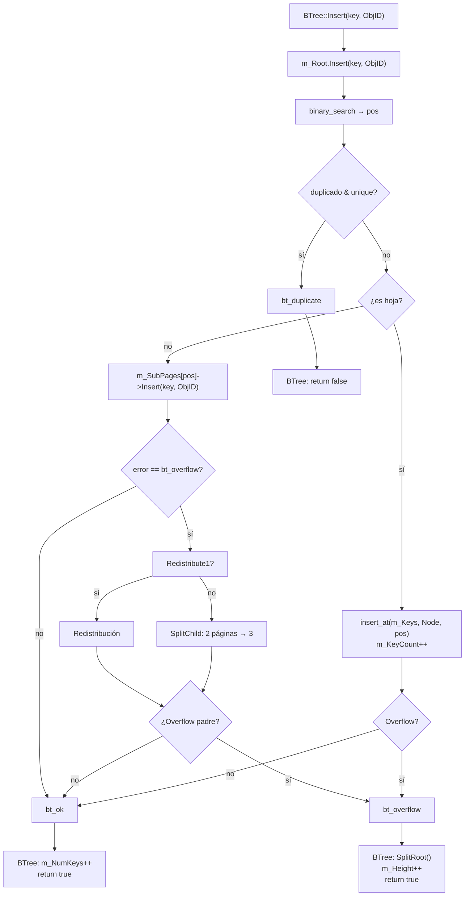
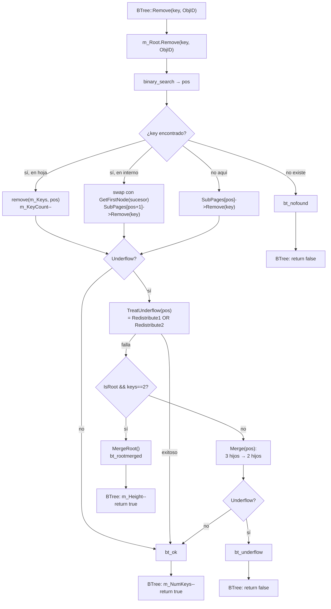
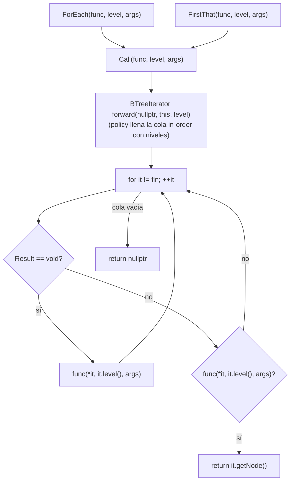
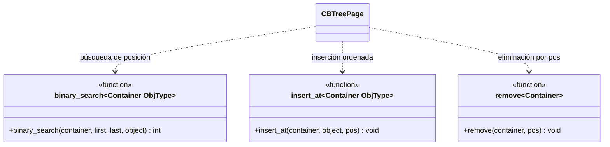

# BTree — Clases y Relaciones

## Diagrama de clases



---

## Iteradores forward/backward (BTreePage.h)

`BTreeIterator<Container, Policy>` y las policies viven en `BTreePage.h`
(se movieron desde `BTree.h` para que `CBTreePage::Call` pueda usarlos).
El iterador hereda de `general_iterator` y recorre el árbol en orden usando
una cola (`deque<pair<Node*, tree_height_t>>`) llenada de una sola vez por
la `Policy` en el constructor. Cada entrada guarda el nodo y su nivel de
profundidad, expuesto vía `level()`.

- **BTreeForwardInorderPolicy::construir** — recorre la página directamente
  (recursión in-order sobre `m_Keys`/`m_SubPages`, es `friend` de `CBTreePage`),
  empujando cada `(Node*, nivel)` a la cola en orden ascendente. No usa
  `ForEach`: eso crearía dependencia circular con `Call`, que ahora consume
  el iterador.
- **BTreeBackwardInorderPolicy::construir** — reusa `BTreeForwardInorderPolicy::construir`
  y luego hace `std::reverse` sobre la cola. No existe un `ForEachReverse` propio:
  el recorrido inverso se logra invirtiendo el resultado forward.
- `operator++` (`avanzar()`) hace `pop_front()` de la cola; al vaciarse, `m_pNode = nullptr` (fin).

`BTree` expone los alias `forward_iterator` / `backward_iterator` y los métodos
`begin()/end()` (con `scoped_lock`) y `rbegin()/rend()`, habilitando range-for.
Además, `BTree::ForEach(lpfn, args...)` delega en el `::ForEach` externo de
`foreach.h` construyendo los iteradores directamente (no vía `begin()/end()`,
que re-tomarían el mutex); a diferencia de `::ForEach(bt.begin(), bt.end(), ...)`,
el mutex queda tomado durante todo el recorrido.

```cpp
for (auto& node : miBTree)        { /* forward, in-order */ }
for (auto it = bt.rbegin(); it != bt.rend(); ++it) { /* backward */ }
bt.ForEach([](Node& n){ ... });   // ::ForEach externo, mutex sostenido
```



---

## Flujo de Insert



---

## Flujo de Remove



---

## Call: motor único de ForEach/FirstThat (BTreePage.h)

`CBTreePage::Call` es privado y hace el recorrido real. `ForEach` y `FirstThat`
son wrappers públicos de una línea que delegan en él. Ya no es recursivo:
construye un `BTreeIterator` forward sobre `this` (la recursión in-order vive
en la policy, que materializa la cola completa) y hace un loop lineal sobre él,
recuperando el nivel de cada nodo con `it.level()`.
El modo (void = visita todos / bool = busca primero que cumpla) se decide en
tiempo de compilación con `if constexpr (is_void_v<Result>)`, según el tipo de
retorno de `Func`. No hay branching en runtime por nodo.

Costo: materializar la cola es O(N) en memoria por recorrido, frente al O(altura)
de la versión recursiva anterior; se acepta como precio de unificar el recorrido
sobre el iterador.



---

## Funciones libres (BTreePage.h)


