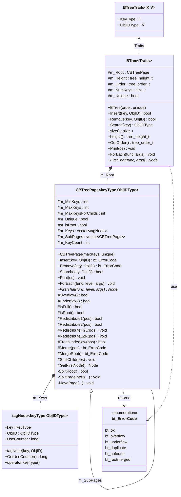
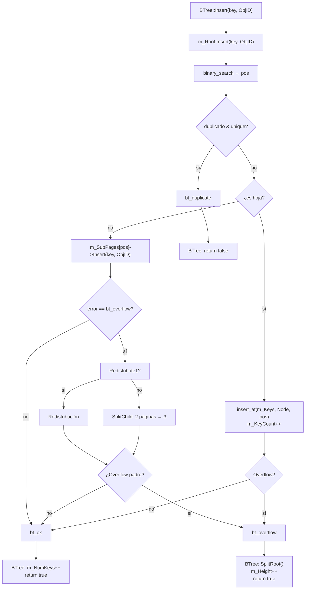
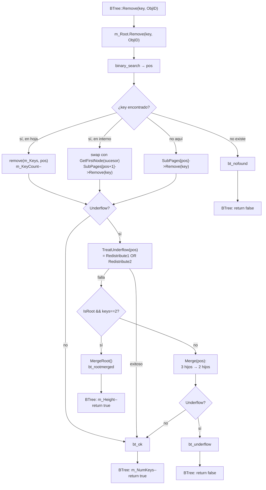
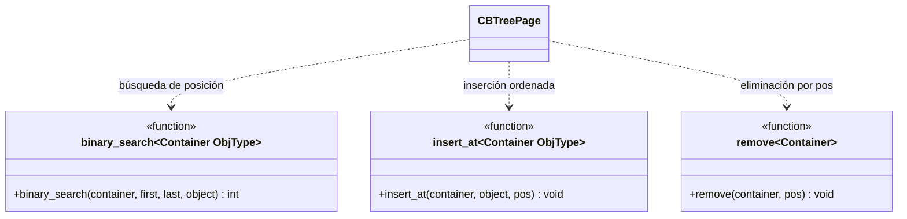

# BTree — Clases y Relaciones

## Diagrama de clases

```mermaid
classDiagram
    class BTreeTraits~K V~ {
        +KeyType : K
        +ObjIDType : V
    }

    class BTree~Traits~ {
        #m_Root : CBTreePage
        #m_Height : tree_height_t
        #m_Order : tree_order_t
        #m_NumKeys : size_t
        #m_Unique : bool
        +BTree(order, unique)
        +Insert(key, ObjID) bool
        +Remove(key, ObjID) bool
        +Search(key) ObjIDType
        +size() size_t
        +height() tree_height_t
        +GetOrder() tree_order_t
        +Print(os) void
        +ForEach(func, args) void
        +FirstThat(func, args) Node*
    }

    class tagNode~keyType ObjIDType~ {
        +key : keyType
        +ObjID : ObjIDType
        +UseCounter : long
        +tagNode(key, ObjID)
        +GetUseCounter() long
        +operator keyType()
    }

    class bt_ErrorCode {
        <<enumeration>>
        bt_ok
        bt_overflow
        bt_underflow
        bt_duplicate
        bt_nofound
        bt_rootmerged
    }

    class CBTreePage~keyType ObjIDType~ {
        #m_MinKeys : int
        #m_MaxKeys : int
        #m_MaxKeysForChilds : int
        #m_Unique : bool
        #m_isRoot : bool
        #m_Keys : vector~tagNode~
        #m_SubPages : vector~CBTreePage*~
        #m_KeyCount : int
        +CBTreePage(maxKeys, unique)
        +Insert(key, ObjID) bt_ErrorCode
        +Remove(key, ObjID) bt_ErrorCode
        +Search(key, ObjID) bool
        +Print(os) void
        +ForEach(func, level, args) void
        +FirstThat(func, level, args) Node*
        #Overflow() bool
        #Underflow() bool
        #IsFull() bool
        #IsRoot() bool
        #Redistribute1(pos) bool
        #Redistribute2(pos) bool
        #RedistributeR2L(pos) void
        #RedistributeL2R(pos) void
        #TreatUnderflow(pos) bool
        #Merge(pos) bt_ErrorCode
        #MergeRoot() bt_ErrorCode
        #SplitChild(pos) void
        #GetFirstNode() Node
        -SplitRoot() bool
        -SplitPageInto3(...) void
        -MovePage(...) void
    }

    BTreeTraits <.. BTree : Traits
    BTree *-- CBTreePage : m_Root
    CBTreePage *-- tagNode : m_Keys
    CBTreePage o-- CBTreePage : m_SubPages
    CBTreePage ..> bt_ErrorCode : retorna
    BTree ..> bt_ErrorCode : usa
```

---

## Flujo de Insert

```mermaid
flowchart TD
    A["BTree::Insert(key, ObjID)"] --> B["m_Root.Insert(key, ObjID)"]
    B --> C["binary_search → pos"]
    C --> D{duplicado & unique?}
    D -->|sí| E[bt_duplicate]
    D -->|no| F{¿es hoja?}
    F -->|sí| G["insert_at(m_Keys, Node, pos)\nm_KeyCount++"]
    F -->|no| H["m_SubPages[pos]->Insert(key, ObjID)"]
    G --> I{Overflow?}
    H --> J{error == bt_overflow?}
    J -->|no| K[bt_ok]
    J -->|sí| L[Redistribute1?]
    L -->|sí| M[Redistribución]
    L -->|no| N[SplitChild: 2 páginas → 3]
    M --> O{¿Overflow padre?}
    N --> O
    O -->|sí| P[bt_overflow]
    O -->|no| K
    I -->|no| K
    I -->|sí| P
    E --> Q["BTree: return false"]
    K --> R["BTree: m_NumKeys++\nreturn true"]
    P --> S["BTree: SplitRoot()\nm_Height++\nreturn true"]
```

---

## Flujo de Remove

```mermaid
flowchart TD
    A["BTree::Remove(key, ObjID)"] --> B["m_Root.Remove(key, ObjID)"]
    B --> C["binary_search → pos"]
    C --> D{¿key encontrado?}
    D -->|no existe| E[bt_nofound]
    D -->|sí, en hoja| F["remove(m_Keys, pos)\nm_KeyCount--"]
    D -->|sí, en interno| G["swap con GetFirstNode(sucesor)\nSubPages[pos+1]->Remove(key)"]
    D -->|no aquí| H["SubPages[pos]->Remove(key)"]
    F --> I{Underflow?}
    G --> I
    H --> I
    I -->|no| J[bt_ok]
    I -->|sí| K["TreatUnderflow(pos)\n= Redistribute1 OR Redistribute2"]
    K -->|exitoso| J
    K -->|falla| L{IsRoot && keys==2?}
    L -->|sí| M["MergeRoot()\nbt_rootmerged"]
    L -->|no| N["Merge(pos):\n3 hijos → 2 hijos"]
    N --> O{Underflow?}
    O -->|sí| P[bt_underflow]
    O -->|no| J
    E --> Q["BTree: return false"]
    M --> R["BTree: m_Height--\nreturn true"]
    J --> S["BTree: m_NumKeys--\nreturn true"]
    P --> T["BTree: return false"]
```

---

## Funciones libres (BTreePage.h)

```mermaid
classDiagram
    class binary_search~Container ObjType~ {
        <<function>>
        +binary_search(container, first, last, object) int
    }
    class insert_at~Container ObjType~ {
        <<function>>
        +insert_at(container, object, pos) void
    }
    class remove~Container~ {
        <<function>>
        +remove(container, pos) void
    }

    CBTreePage ..> binary_search : búsqueda de posición
    CBTreePage ..> insert_at : inserción ordenada
    CBTreePage ..> remove : eliminación por pos
```
