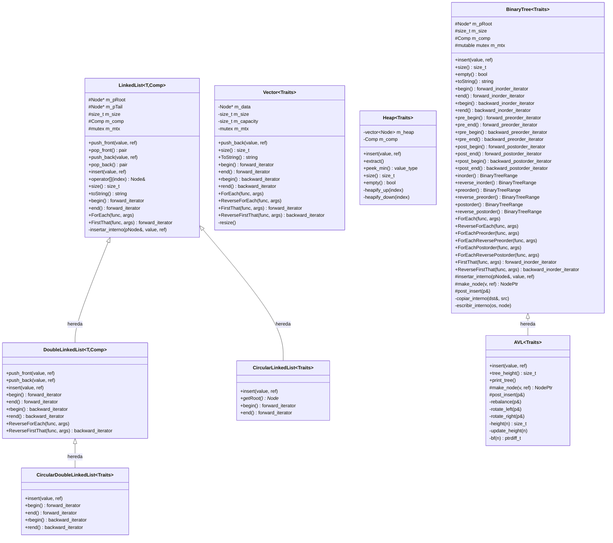
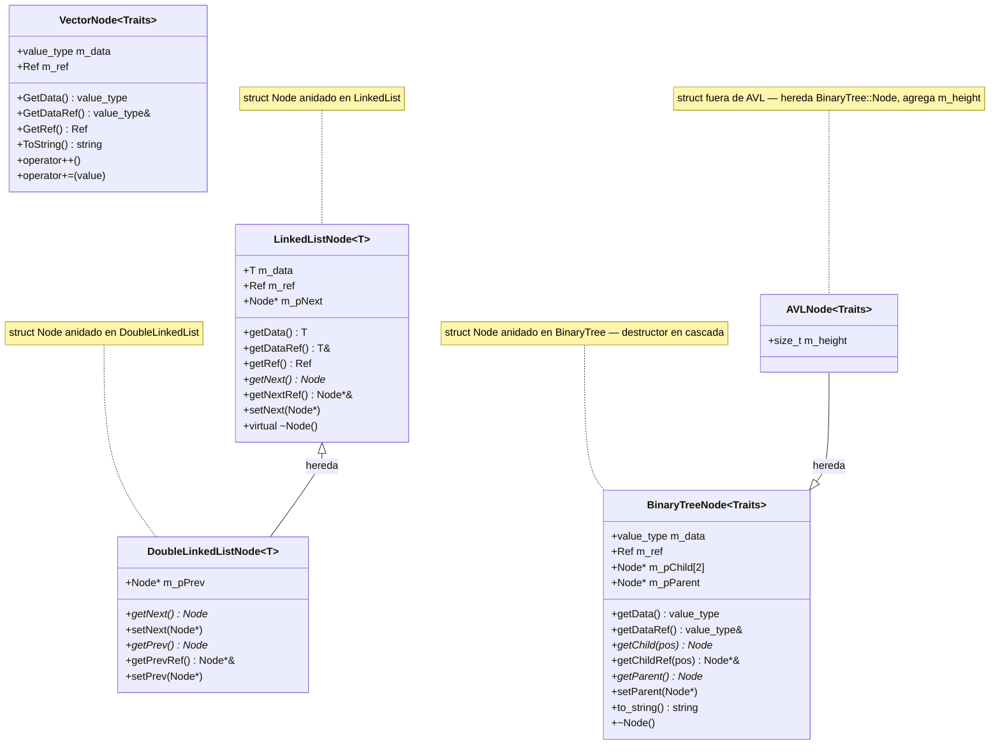
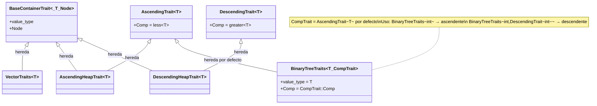
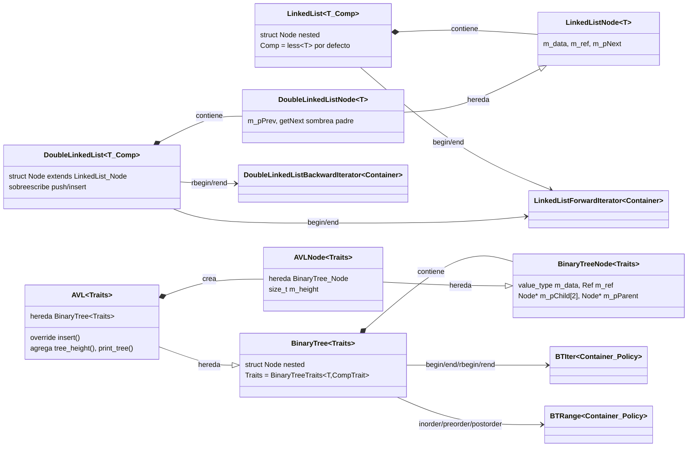
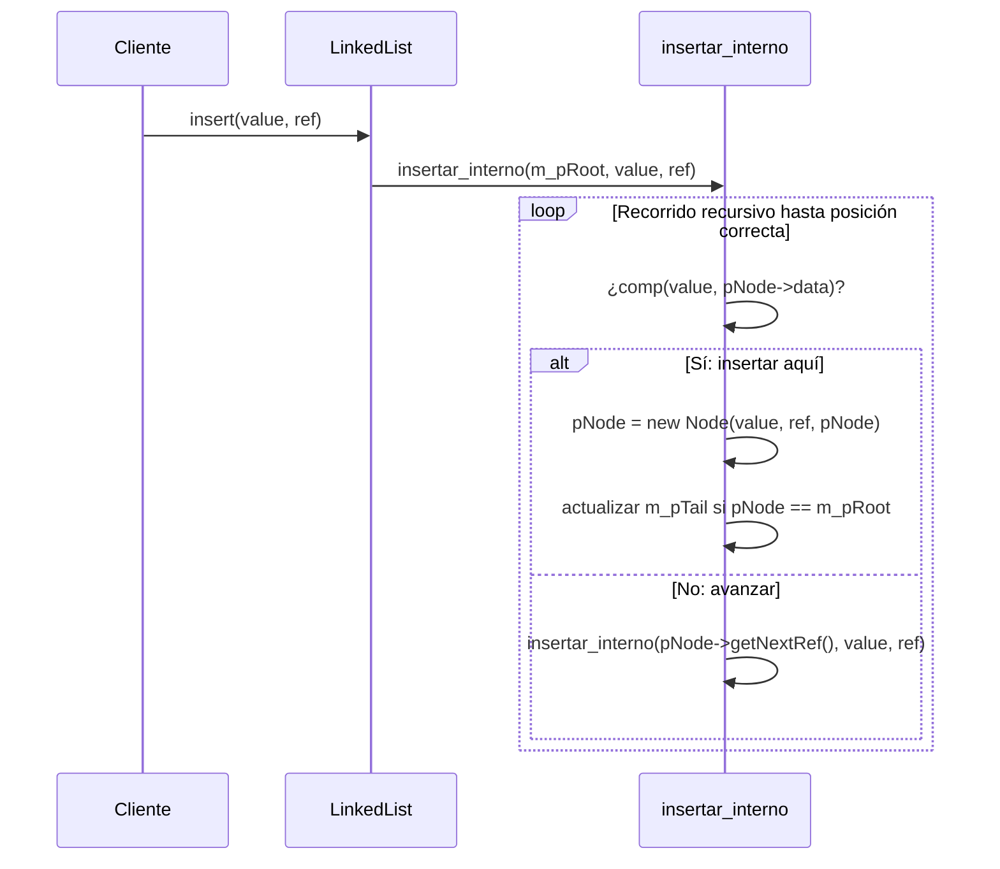
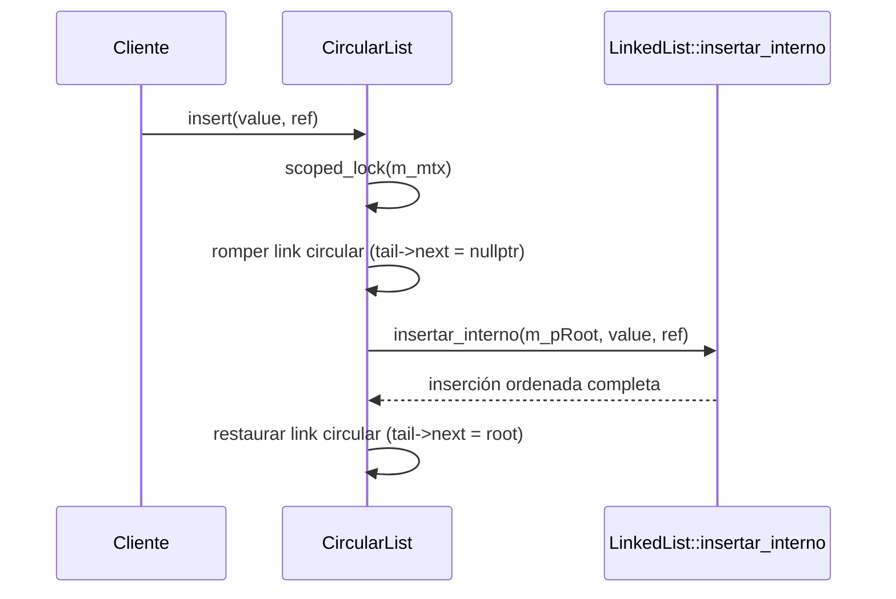
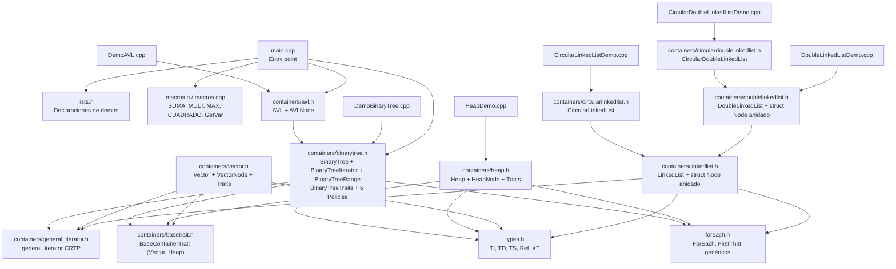
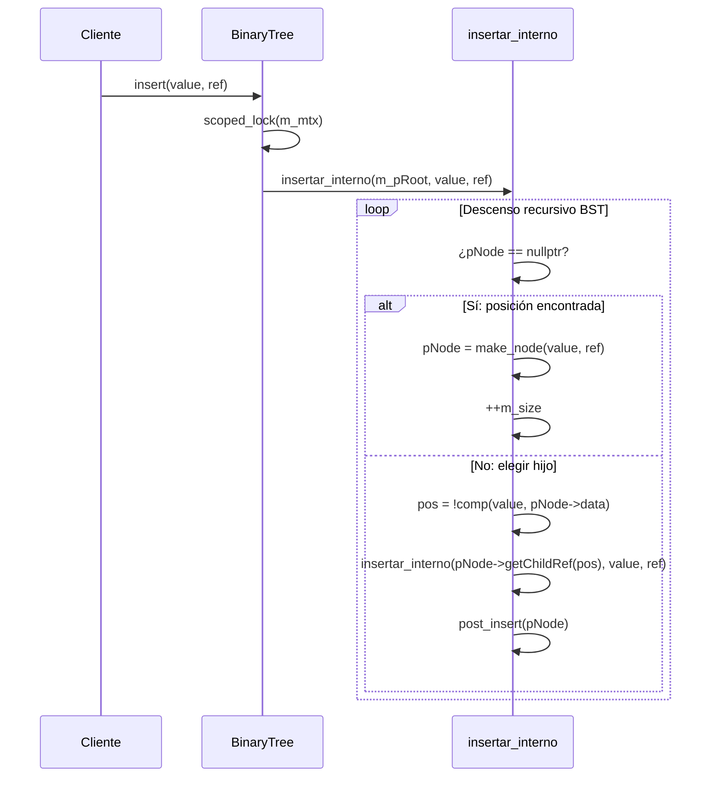
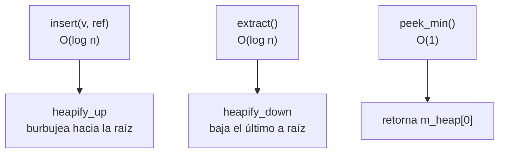

# Arquitectura — EST-DATOS-MCC-001

Documentación de todas las clases, jerarquías y relaciones del repositorio.

> **Diagrama unificado interactivo:** [`docs/jerarquia_clases.md`](docs/jerarquia_clases.md) consolida en un único `classDiagram` Mermaid las 6 jerarquías siguientes (mismas vistas, en un solo grafo navegable).
> **Documentación HTML Doxygen:** ejecutar `doxygen Doxyfile` → `docs/html/inherits.html` (jerarquía gráfica SVG interactiva de toda la librería), `docs/html/classes.html` (índice de clases), `docs/html/graph_legend.html` (leyenda de los grafos).

---

## Jerarquía de contenedores

---

## Jerarquía de Nodos

Los nodos de `LinkedList`, `DoubleLinkedList` y `BinaryTree` están definidos como `struct Node` **anidado dentro del contenedor** — no son clases externas.

---

## Jerarquía de Iteradores

```mermaid
classDiagram
    class general_iterator~Container_IteratorBase~ {
        #Container* m_pContainer
        #Node* m_pNode
        +operator*() Node&
        +operator->() Node*
        +getNode() Node*
        +operator==(a, b) bool
        +operator!=(a, b) bool
    }

    class LinkedListForwardIterator~Container~ {
        +operator++() MySelf&
    }

    class DoubleLinkedListBackwardIterator~Container~ {
        +operator++() MySelf&
    }

    class CircularLinkedListForwardIterator~Container~ {
        +operator++() MySelf&
    }

    class CircularDoubleLinkedListForwardIterator~Container~ {
        +operator++() MySelf&
    }

    class CircularDoubleLinkedListBackwardIterator~Container~ {
        +operator++() MySelf&
    }

    class vector_forward_iterator~Container~ {
        +operator++() MySelf&
    }

    class vector_backward_iterator~Container~ {
        +operator++() MySelf&
    }

    class BinaryTreeIterator~Container_Policy~ {
        -deque~Node*~ m_cola
        +operator++() MySelf&
    }
    note for BinaryTreeIterator "Iterador unificado. Policy::construir() llena la deque\nsegún el orden: Inorder/Preorder/Postorder × Forward/Backward"

    class BinaryTreeRange~Container_Policy~ {
        -unique_lock~mutex~ m_lock
        -Iter m_begin
        -Iter m_end
        +begin() Iter
        +end() Iter
    }
    note for BinaryTreeRange "Rango iterable para range-for.\nAdquiere unique_lock durante toda la iteración.\nMovible, no copiable."

    general_iterator <|-- LinkedListForwardIterator : hereda
    general_iterator <|-- DoubleLinkedListBackwardIterator : hereda
    general_iterator <|-- CircularLinkedListForwardIterator : hereda
    general_iterator <|-- CircularDoubleLinkedListForwardIterator : hereda
    general_iterator <|-- CircularDoubleLinkedListBackwardIterator : hereda
    general_iterator <|-- vector_forward_iterator : hereda
    general_iterator <|-- vector_backward_iterator : hereda
    general_iterator <|-- BinaryTreeIterator : hereda
    BinaryTreeRange --> BinaryTreeIterator : produce
```

> `LinkedListForwardIterator` es reutilizado por `DoubleLinkedList` como `forward_iterator`.
> `BinaryTreeIterator` reemplaza las 6 clases anteriores — la Policy en el parámetro de template selecciona el orden de recorrido.

---

## Traits (Vector, Heap y BinaryTree)

`LinkedList` y `DoubleLinkedList` se parametrizan directamente con `template<T, Comp = less<T>>`. `Vector`, `Heap` y **`BinaryTree`** usan el patrón Traits.

---

## Asociación: Contenedor ↔ Nodo anidado ↔ Iterador

---

## Flujo de inserción ordenada (insert)

---

## Flujo de inserción en lista circular (CLL / CDLL)

---

## Mapa de archivos

---

## Flujo de inserción en BST (BinaryTree)

---

## Iteradores de BinaryTree — Órdenes de recorrido

Todos usan la clase unificada `BinaryTreeIterator<Container, Policy>`. La `Policy` selecciona el orden:

| Policy | Orden | Método de acceso directo | Método range-for |
|---|---|---|---|
| `BinaryTreeForwardInorderPolicy` | LNR (izq → nodo → der) | `begin()` / `end()` | `inorder()` |
| `BinaryTreeBackwardInorderPolicy` | RNL (der → nodo → izq) | `rbegin()` / `rend()` | `reverse_inorder()` |
| `BinaryTreeForwardPreorderPolicy` | NLR (nodo → izq → der) | `pre_begin()` / `pre_end()` | `preorder()` |
| `BinaryTreeBackwardPreorderPolicy` | NRL (nodo → der → izq) | `rpre_begin()` / `rpre_end()` | `reverse_preorder()` |
| `BinaryTreeForwardPostorderPolicy` | LRN (izq → der → nodo) | `post_begin()` / `post_end()` | `postorder()` |
| `BinaryTreeBackwardPostorderPolicy` | RLN (der → izq → nodo) | `rpost_begin()` / `rpost_end()` | `reverse_postorder()` |

> `deque<Node*>` pre-construida en constructor (`Policy::construir()` recursivo). `operator++` solo avanza la deque. Coste: O(n) tiempo y espacio.
>
> Los métodos `inorder()` / `preorder()` / etc. devuelven `BinaryTreeRange` — adquieren `unique_lock<mutex>` durante toda la iteración, habilitando `for(auto& n : bt.inorder())`.
>
> **Advertencia:** no llamar `.inorder()` dentro de un método que ya tenga `scoped_lock` sobre el mismo mutex — `BinaryTree::mutex` no es reentrante. Ver `toString()` que usa iterador directo sin lock.

---

## AVL — árbol balanceado

`AVL<Traits>` hereda todo de `BinaryTree<Traits>`. Usa el patrón **Template Method**: `BinaryTree::insertar_interno` deja dos hooks virtuales que AVL sobreescribe — `make_node()` crea `AVLNode` en vez de `Node`, y `post_insert()` llama `rebalance()` al volver de cada nivel recursivo. No duplica la lógica de descenso BST.

### Nodo AVL

`AVLNode<Traits>` extiende `BinaryTree<Traits>::Node` con un campo `size_t m_height`. El árbol AVL solo crea nodos de tipo `AVLNode` y usa `static_cast` interno para acceder a `m_height`.

### Factor de balance y rotaciones

| Factor de balance `bf = h(izq) - h(der)` | Caso | Acción |
|---|---|---|
| `bf > 1` y `bf(izq) >= 0` | LL | `rotate_right(p)` |
| `bf > 1` y `bf(izq) < 0` | LR | `rotate_left(izq)` → `rotate_right(p)` |
| `bf < -1` y `bf(der) <= 0` | RR | `rotate_left(p)` |
| `bf < -1` y `bf(der) > 0` | RL | `rotate_right(der)` → `rotate_left(p)` |

### API exclusiva de AVL

| Método | Descripción |
|--------|-------------|
| `insert(value, ref)` | Llama `BinaryTree::insertar_interno` — hooks `make_node`/`post_insert` inyectan `AVLNode` y `rebalance()` |
| `tree_height()` | Altura del árbol (O(1) — lee `m_height` de la raíz) |
| `print_tree()` | Árbol girado 90°: rama derecha arriba, izquierda abajo, muestra `dato (h=N)` |

### Herencia completa desde BinaryTree

AVL reutiliza sin cambios: todos los iteradores, `ForEach` / variantes, `FirstThat`, `toString`, `operator<<`, `operator>>`, `size()`, `empty()`, constructores de copia/movimiento, destructor.

---

## Heap — operaciones y complejidad

| Operación | Complejidad | Descripción |
|-----------|-------------|-------------|
| `insert` | O(log n) | Inserta al final, sube hasta posición correcta |
| `extract` | O(log n) | Extrae raíz, sube último elemento, baja |
| `peek_min` | O(1) | Accede `m_heap[0]` sin modificar |

---

## Operadores de stream

| Clase | `operator<<` | `operator>>` |
|-------|-------------|--------------|
| `VectorNode` | imprime `(data, ref)` | — |
| `Vector` | imprime `[n0, n1, ...]` | — |
| `LinkedList::Node` | imprime `(data, ref)` | — |
| `LinkedList` | llama `toString()` | `push_back` desde stream |
| `DoubleLinkedList` | hereda `LinkedList::operator<<` | hereda `LinkedList::operator>>` |
| `BinaryTree::Node` | imprime `Nodo(dato: X, ref: Y)` | lee `dato ref` por línea |
| `BinaryTree` | escribe `n` + nodos en preorden (`dato ref\n`) | lee conteo + `dato ref` → `insert()` |

---

## Concurrencia

Todos los contenedores usan `std::mutex m_mtx` (en `protected` de `LinkedList`, heredado por `DoubleLinkedList` / `mutable` en `BinaryTree`).

| Operación | Mecanismo |
|-----------|-----------|
| `push_front / push_back` | `scoped_lock<mutex>` |
| `pop_front / pop_back` | `scoped_lock<mutex>` |
| `insert` (LinkedList) | sin lock en entrada — `insertar_interno` privado sin lock |
| `insert` (DoubleLinkedList) | `scoped_lock<mutex>` en override |
| `toString` (LinkedList) | sin lock — uso interno |
| `ForEach` (LinkedList) | `unique_lock<mutex>` |
| `ForEach` (DoubleLinkedList) | `unique_lock<mutex>` |
| `BinaryTree::insert` | `scoped_lock<mutex>` |
| `BinaryTree::ForEach` / variantes | `scoped_lock<mutex>` |
| `BinaryTree::FirstThat` / `ReverseFirstThat` | `scoped_lock<mutex>` |
| `BinaryTree::toString` | `scoped_lock<mutex>` |
| `BinaryTree::operator<<` | `scoped_lock<mutex>` |
| `BinaryTree` copy/move constructors | `scoped_lock<mutex>` sobre `other.m_mtx` |
| `BinaryTree` destructor | `scoped_lock<mutex>` |
| `BinaryTree::inorder()` / variantes range-for | `unique_lock<mutex>` — mantenido durante toda la iteración |
| `AVL::insert` | `scoped_lock<mutex>` (override de BinaryTree::insert) |
| `AVL::tree_height` | `scoped_lock<mutex>` |
| `AVL::print_tree` | `scoped_lock<mutex>` |

> `insertar_interno`, `make_node`, `post_insert`, `copiar_interno`, `escribir_interno`, `rebalance`, rotaciones — no adquieren lock propio, siempre llamados bajo lock del método público.

---

## Patrones de diseño utilizados

| Patrón | Dónde |
|--------|-------|
| **CRTP** (Curiously Recurring Template Pattern) | `general_iterator<Container, IteratorBase>` |
| **Nodo anidado** (nested Node) | `struct Node` dentro de `LinkedList`, `DoubleLinkedList`, `BinaryTree` |
| **Traits** | `Vector`, `Heap`, `BinaryTree` (via `BinaryTreeTraits<T, CompTrait>`) |
| **Policy** | `BinaryTreeIterator<Container, Policy>` — 6 policies seleccionan el orden de recorrido |
| **RAII** | `scoped_lock<mutex>` en todas las operaciones mutantes; `unique_lock` en `BinaryTreeRange` |
| **Move semantics** | constructores y operadores de movimiento en `LinkedList`, `BinaryTree`; `BinaryTreeRange` movible |
| **Variadic templates** | `ForEach`, `FirstThat` con `Args&&...` |
| **Perfect forwarding** | `std::forward<Args>(args)...` en ForEach/FirstThat |
| **Template Method** | `BinaryTree::insertar_interno` define el esqueleto BST; hooks virtuales `make_node` y `post_insert` permiten que `AVL` cambie tipo de nodo y añada rebalanceo sin duplicar lógica |
| **Herencia de template** | `AVL<Traits>` extiende `BinaryTree<Traits>`; `AVLNode` extiende `Node` |
