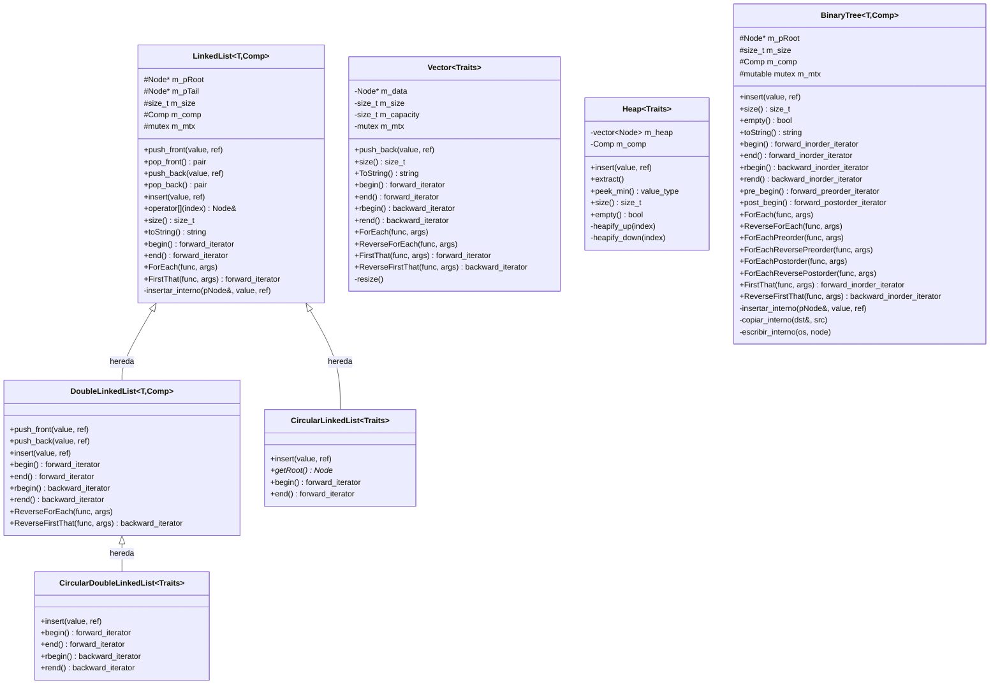
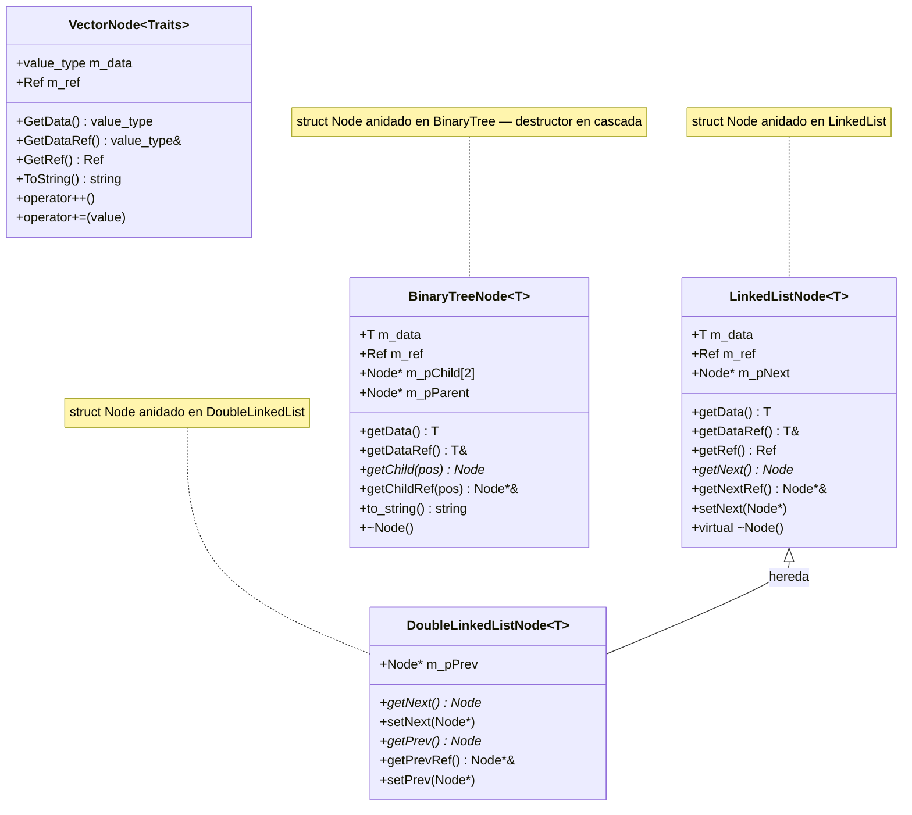
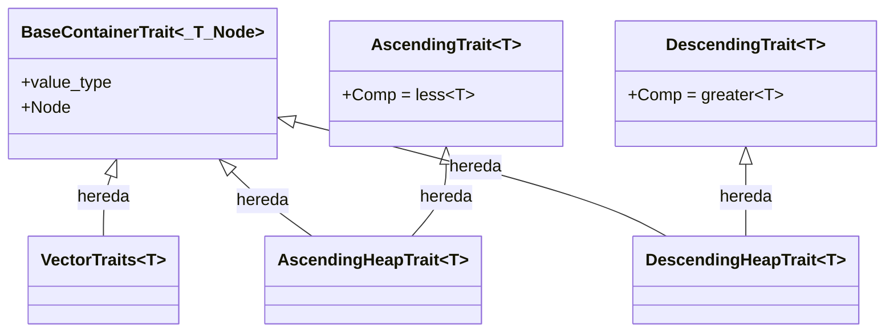
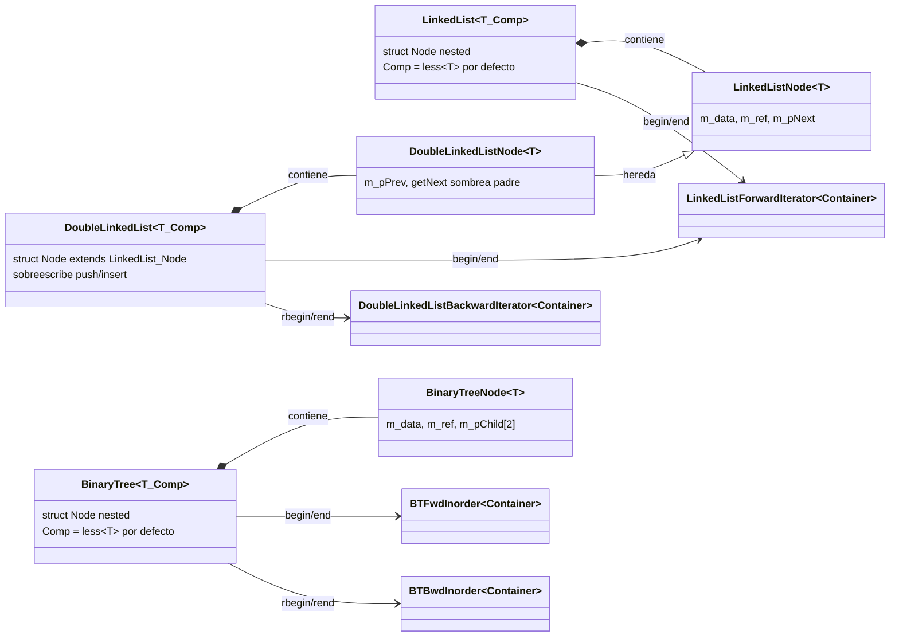
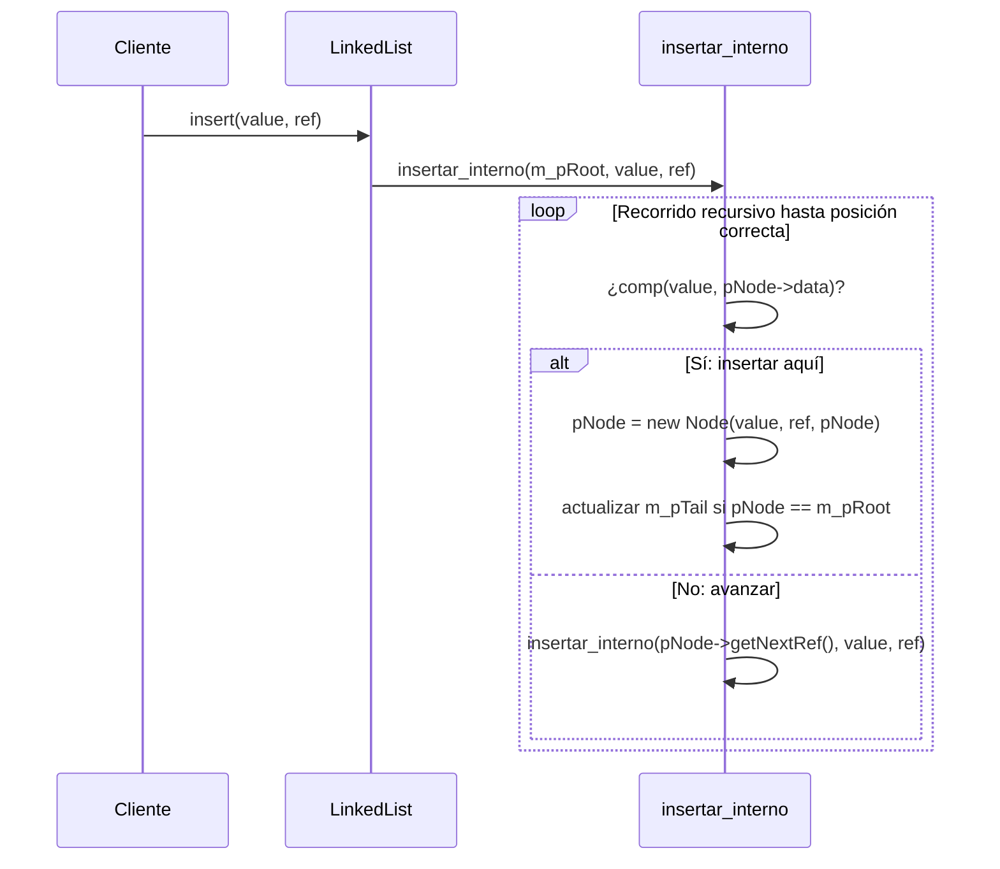
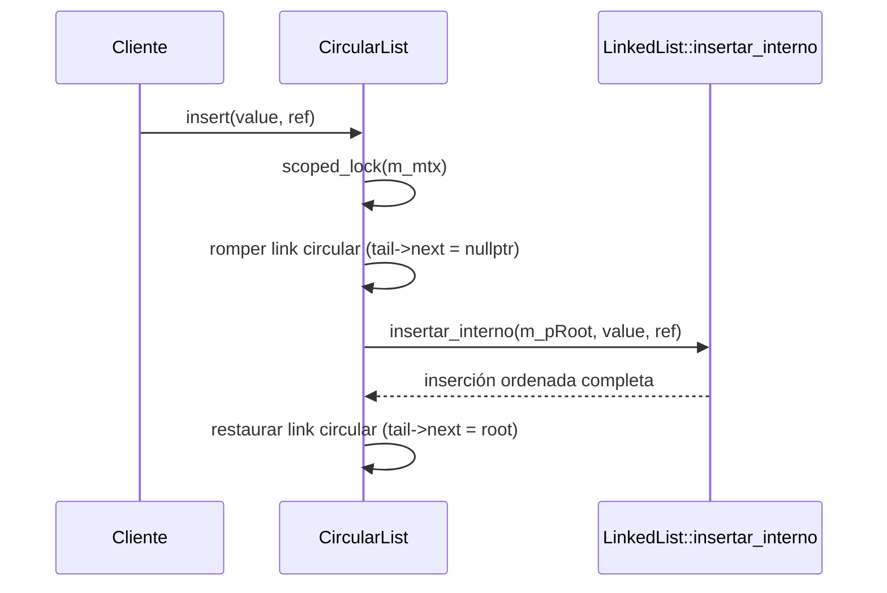
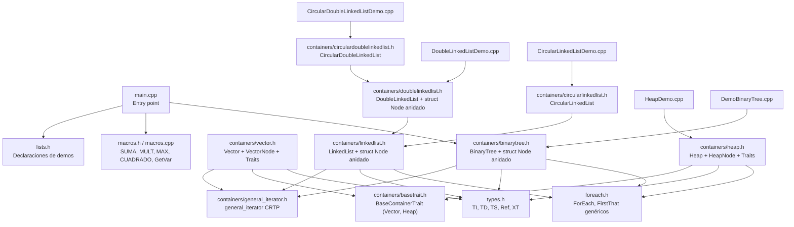
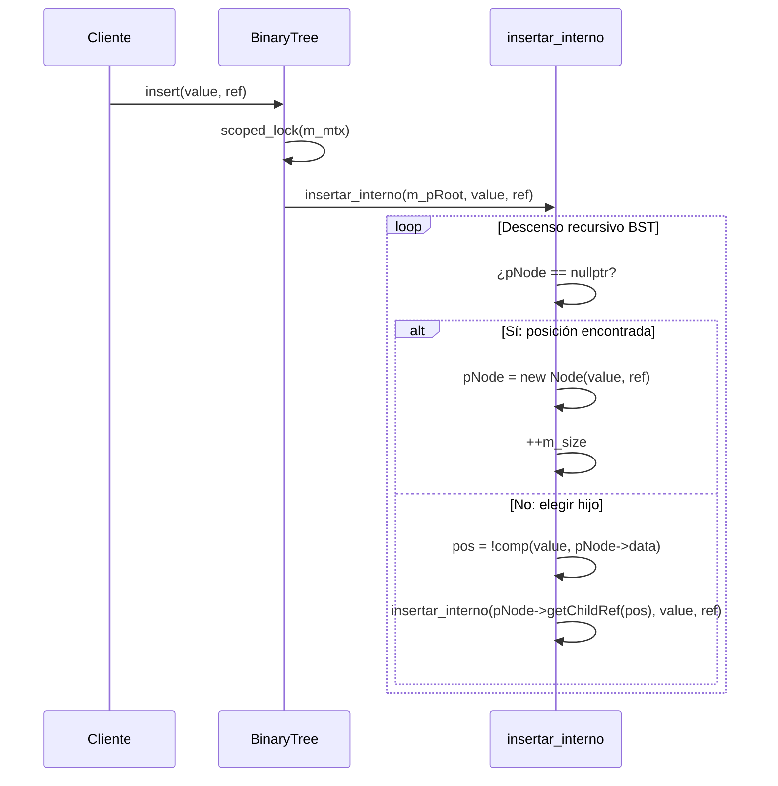
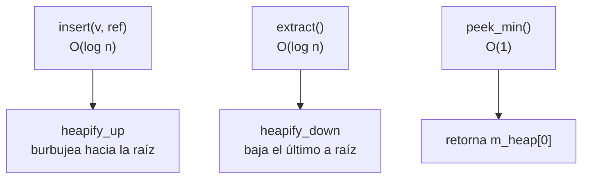

# Arquitectura — EST-DATOS-MCC-001

Documentación de todas las clases, jerarquías y relaciones del repositorio.

---

## Jerarquía de contenedores

---

## Jerarquía de Nodos

Los nodos de `LinkedList`, `DoubleLinkedList` y `BinaryTree` están definidos como `struct Node` **anidado dentro del contenedor** — no son clases externas.

---

## Jerarquía de Iteradores

```mermaid
classDiagram
    class general_iterator~Container_IteratorBase~ {
        #Container* m_pContainer
        #Node* m_pNode
        +operator*() Node&
        +operator->() Node*
        +getNode() Node*
        +operator==(a, b) bool
    }

    class LinkedListForwardIterator~Container~ {
        +operator++() MySelf&
    }

    class DoubleLinkedListBackwardIterator~Container~ {
        +operator++() MySelf&
    }

    class CircularLinkedListForwardIterator~Container~ {
        +operator++() MySelf&
    }

    class CircularDoubleLinkedListForwardIterator~Container~ {
        +operator++() MySelf&
    }

    class CircularDoubleLinkedListBackwardIterator~Container~ {
        +operator++() MySelf&
    }

    class vector_forward_iterator~Container~ {
        +operator++() MySelf&
    }

    class vector_backward_iterator~Container~ {
        +operator++() MySelf&
    }

    class BinaryTreeForwardInorderIterator~Container~ {
        -deque~Node*~ m_cola
        +operator++() MySelf&
    }
    class BinaryTreeBackwardInorderIterator~Container~ {
        -deque~Node*~ m_cola
        +operator++() MySelf&
    }
    class BinaryTreeForwardPreorderIterator~Container~ {
        -deque~Node*~ m_cola
        +operator++() MySelf&
    }
    class BinaryTreeBackwardPreorderIterator~Container~ {
        -deque~Node*~ m_cola
        +operator++() MySelf&
    }
    class BinaryTreeForwardPostorderIterator~Container~ {
        -deque~Node*~ m_cola
        +operator++() MySelf&
    }
    class BinaryTreeBackwardPostorderIterator~Container~ {
        -deque~Node*~ m_cola
        +operator++() MySelf&
    }

    general_iterator <|-- LinkedListForwardIterator : hereda
    general_iterator <|-- DoubleLinkedListBackwardIterator : hereda
    general_iterator <|-- CircularLinkedListForwardIterator : hereda
    general_iterator <|-- CircularDoubleLinkedListForwardIterator : hereda
    general_iterator <|-- CircularDoubleLinkedListBackwardIterator : hereda
    general_iterator <|-- vector_forward_iterator : hereda
    general_iterator <|-- vector_backward_iterator : hereda
    general_iterator <|-- BinaryTreeForwardInorderIterator : hereda
    general_iterator <|-- BinaryTreeBackwardInorderIterator : hereda
    general_iterator <|-- BinaryTreeForwardPreorderIterator : hereda
    general_iterator <|-- BinaryTreeBackwardPreorderIterator : hereda
    general_iterator <|-- BinaryTreeForwardPostorderIterator : hereda
    general_iterator <|-- BinaryTreeBackwardPostorderIterator : hereda
```

> `LinkedListForwardIterator` es reutilizado por `DoubleLinkedList` como `forward_iterator`.

---

## Traits (solo Vector y Heap)

`LinkedList`, `DoubleLinkedList` y `BinaryTree` ya **no** usan traits — se parametrizan directamente con `template<T, Comp = less<T>>` y definen su nodo internamente. `Vector` y `Heap` mantienen el patrón Traits.

---

## Asociación: Contenedor ↔ Nodo anidado ↔ Iterador

---

## Flujo de inserción ordenada (insert)

---

## Flujo de inserción en lista circular (CLL / CDLL)

---

## Mapa de archivos

---

## Flujo de inserción en BST (BinaryTree)

---

## Iteradores de BinaryTree — Órdenes de recorrido

| Clase | Orden | Resultado en BST ascendente |
|---|---|---|
| `BinaryTreeForwardInorderIterator` | LNR (izq → nodo → der) | ascendente |
| `BinaryTreeBackwardInorderIterator` | RNL (der → nodo → izq) | descendente |
| `BinaryTreeForwardPreorderIterator` | NLR (nodo → izq → der) | raíz primero |
| `BinaryTreeBackwardPreorderIterator` | NRL (nodo → der → izq) | raíz primero, der antes izq |
| `BinaryTreeForwardPostorderIterator` | LRN (izq → der → nodo) | raíz al final |
| `BinaryTreeBackwardPostorderIterator` | RLN (der → izq → nodo) | raíz al final, der antes izq |

> Todos usan `deque<Node*>` pre-construida en el constructor (`construir()` recursivo). `operator++` solo avanza la deque. Coste: O(n) tiempo y espacio. Compatible con `general_iterator` CRTP sin modificar la clase base.

---

## Heap — operaciones y complejidad

| Operación | Complejidad | Descripción |
|-----------|-------------|-------------|
| `insert` | O(log n) | Inserta al final, sube hasta posición correcta |
| `extract` | O(log n) | Extrae raíz, sube último elemento, baja |
| `peek_min` | O(1) | Accede `m_heap[0]` sin modificar |

---

## Operadores de stream

| Clase | `operator<<` | `operator>>` |
|-------|-------------|--------------|
| `VectorNode` | imprime `(data, ref)` | — |
| `Vector` | imprime `[n0, n1, ...]` | — |
| `LinkedList::Node` | imprime `(data, ref)` | — |
| `LinkedList` | llama `toString()` | `push_back` desde stream |
| `DoubleLinkedList` | hereda `LinkedList::operator<<` | hereda `LinkedList::operator>>` |
| `BinaryTree::Node` | imprime `Nodo(dato: X, ref: Y)` | lee `dato ref` por línea |
| `BinaryTree` | escribe `n` + nodos en preorden (`dato ref\n`) | lee conteo + `dato ref` → `insert()` |

---

## Concurrencia

Todos los contenedores usan `std::mutex m_mtx` (en `protected` de `LinkedList`, heredado por `DoubleLinkedList` / `mutable` en `BinaryTree`).

| Operación | Mecanismo |
|-----------|-----------|
| `push_front / push_back` | `scoped_lock<mutex>` |
| `pop_front / pop_back` | `scoped_lock<mutex>` |
| `insert` (LinkedList) | sin lock en entrada — `insertar_interno` privado sin lock |
| `insert` (DoubleLinkedList) | `scoped_lock<mutex>` en override |
| `toString` (LinkedList) | sin lock — uso interno |
| `ForEach` (LinkedList) | `unique_lock<mutex>` |
| `ForEach` (DoubleLinkedList) | `unique_lock<mutex>` |
| `BinaryTree::insert` | `scoped_lock<mutex>` |
| `BinaryTree::ForEach` / variantes | `scoped_lock<mutex>` |
| `BinaryTree::FirstThat` / `ReverseFirstThat` | `scoped_lock<mutex>` |
| `BinaryTree::toString` | `scoped_lock<mutex>` |
| `BinaryTree::operator<<` | `scoped_lock<mutex>` |
| `BinaryTree` copy/move constructors | `scoped_lock<mutex>` sobre `other.m_mtx` |
| `BinaryTree` destructor | `scoped_lock<mutex>` |

> `insertar_interno`, `copiar_interno`, `escribir_interno` no adquieren lock propio — siempre llamados bajo lock del método público.

---

## Patrones de diseño utilizados

| Patrón | Dónde |
|--------|-------|
| **CRTP** (Curiously Recurring Template Pattern) | `general_iterator<Container, IteratorBase>` |
| **Nodo anidado** (nested Node) | `struct Node` dentro de `LinkedList`, `DoubleLinkedList`, `BinaryTree` |
| **Traits** | solo `Vector` y `Heap` — LL/DLL/BT usan `template<T, Comp>` directo |
| **RAII** | `scoped_lock<mutex>` en todas las operaciones mutantes |
| **Move semantics** | constructores y operadores de movimiento en `LinkedList`, `BinaryTree` |
| **Variadic templates** | `ForEach`, `FirstThat` con `Args&&...` |
| **Perfect forwarding** | `std::forward<Args>(args)...` en ForEach/FirstThat |
