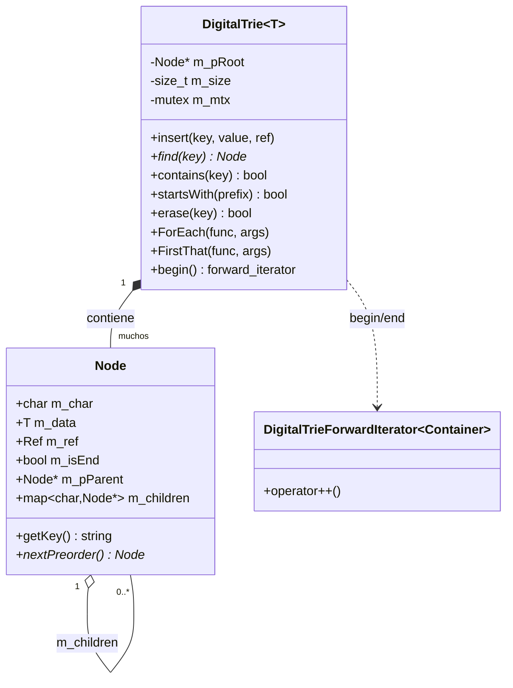
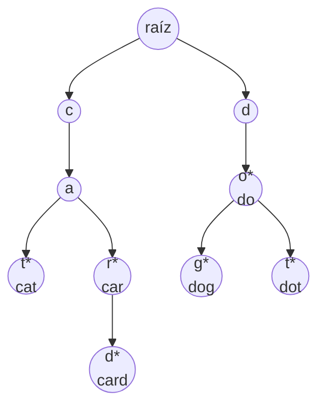
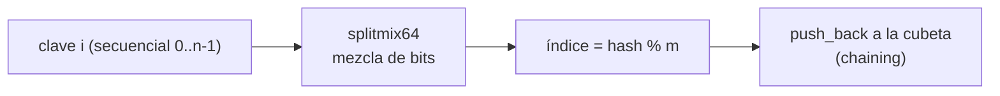
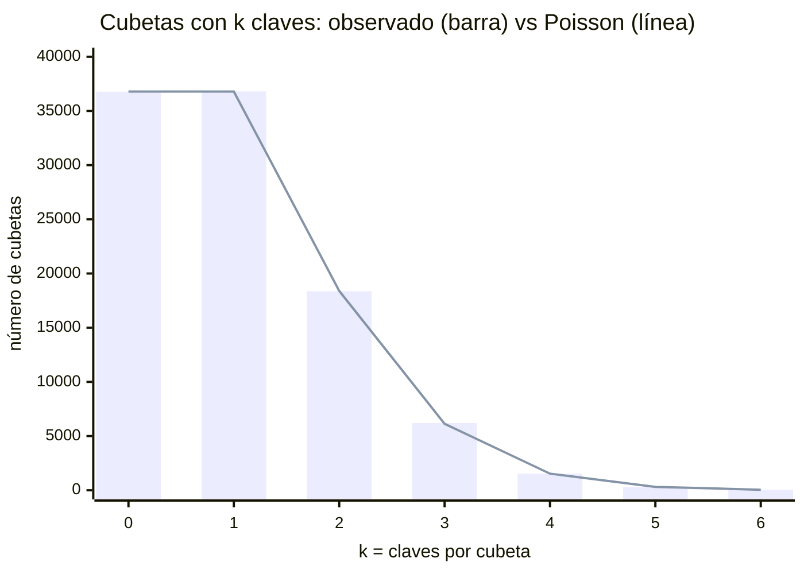
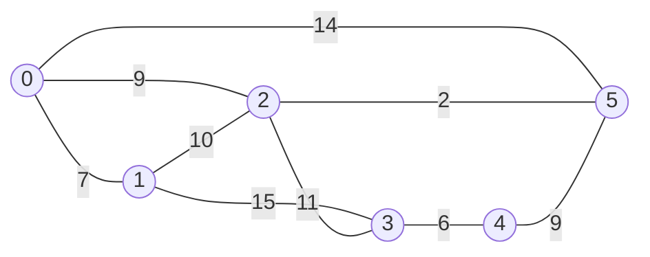
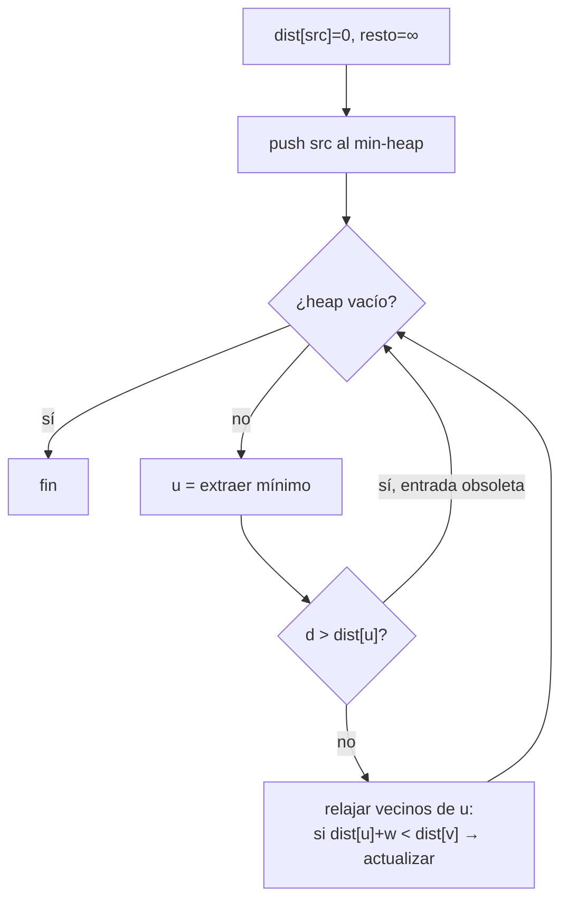
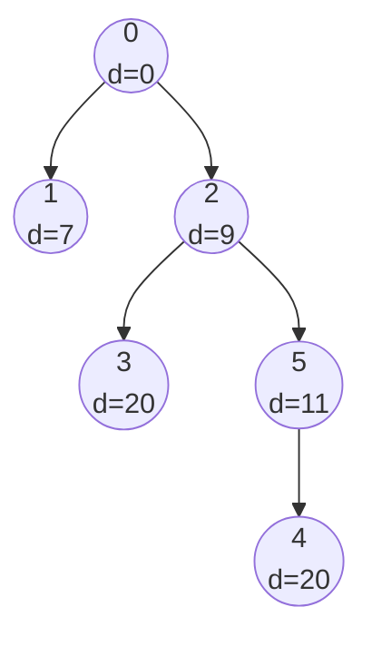
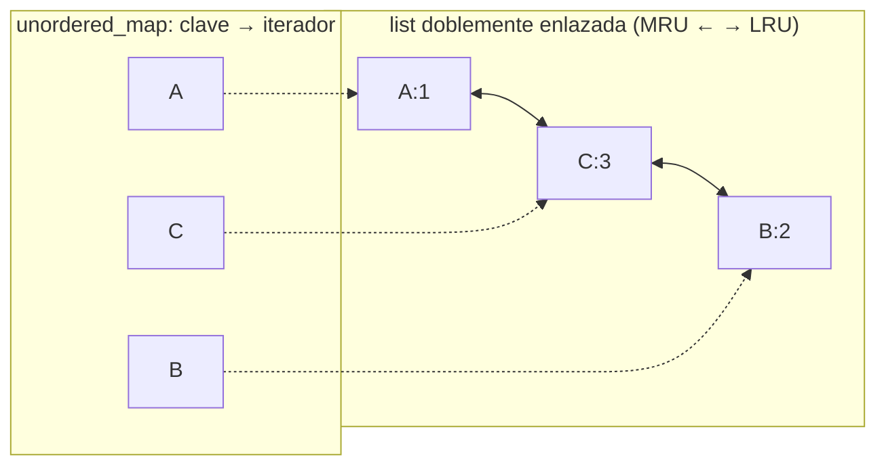
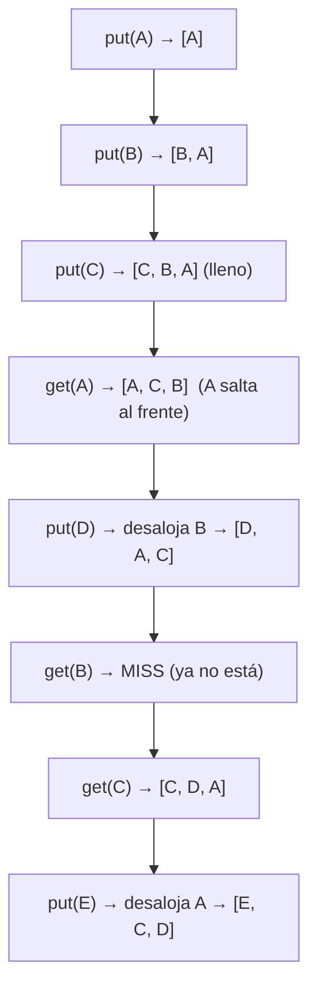

# Estructuras y demos — Guía visual (Mermaid)

Documento de apoyo para presentación. Cubre cuatro demos del repositorio:

1. [Digital Trie](#1-digital-trie-árbol-de-prefijos)
2. [Tabla Hash y distribución de Poisson](#2-tabla-hash--distribución-de-poisson)
3. [Dijkstra — camino más corto (STL)](#3-dijkstra--camino-más-corto)
4. [LRU Cache (STL)](#4-lru-cache)

Todas usan los alias de tipos del proyecto (`types.h`): `TI=int`, `TD=double`, `TS=string`, `Ref=long`.

---

## 1. Digital Trie (árbol de prefijos)

**Qué resuelve:** almacenar un conjunto de cadenas para buscar por **clave exacta** y por **prefijo** en tiempo proporcional al largo de la clave, no al número de claves. Recorrido en **orden lexicográfico** gratis.

**Contenedor STL clave:** `std::map<char, Node*>` en cada nodo → hijos ordenados por carácter (por eso el recorrido sale ordenado).

### Estructura de clases

### Ejemplo del demo

Insertando `cat, car, card, dog, do, dot`. Los nodos marcados con `*` son **terminales** (fin de una clave):

Observaciones para exponer:
- `car` y `card` **comparten** el prefijo `car` → no se duplica.
- `startsWith("ca")` es `true` aunque `"ca"` no sea terminal.
- El recorrido preorden entrega: `car, card, cat, do, dog, dot` (lexicográfico).

### Operaciones y costos (n = largo de la clave)

| Operación | Costo | Nota |
|---|---|---|
| `insert` / `find` / `contains` | O(n) | independiente del nº de claves |
| `startsWith(prefix)` | O(largo del prefijo) | |
| `erase` | O(n) | además **poda** nodos hoja no terminales |
| recorrido completo | O(nodos) | orden lexicográfico |

---

## 2. Tabla Hash + distribución de Poisson

**Qué demuestra:** con `m` cubetas, `n` claves y factor de carga `λ = n/m`, la **longitud de cada cadena** (colisiones por cubeta) sigue una **distribución de Poisson**:

$$P(\text{cubeta con } k \text{ claves}) = \frac{e^{-\lambda}\,\lambda^{k}}{k!}$$

### Flujo de inserción

El mezclador `splitmix64` convierte claves **ordenadas** en índices **dispersos**; sin él no habría distribución Poisson.

### Observado vs. teórico (m = n = 100000, λ = 1)

La barra (medido) y la línea (Poisson teórico) coinciden → confirma el modelo.

### Puntos para exponer

- `λ = 1` ⇒ ~37% de cubetas vacías (`e^-1 ≈ 0.368`) y ~37% con exactamente 1 clave.
- Colisión = cubeta con `k ≥ 2`. Poisson predice cuántas.
- Un **buen hash** hace que la entrada, aunque ordenada, se comporte como aleatoria uniforme → `Binomial(n, 1/m) ≈ Poisson(λ)`.

---

## 3. Dijkstra — camino más corto

**Qué resuelve:** ruta de **costo mínimo** desde un nodo origen a todos los demás en un grafo ponderado.

**Contenedores STL:**
| Contenedor | Rol |
|---|---|
| `vector<vector<pair<TI,TI>>>` | lista de adyacencia (destino, peso) |
| `priority_queue` (min-heap con `greater`) | extraer siempre el nodo más cercano |
| `vector<TI> dist`, `vector<TI> prev` | distancias y predecesores |

### Grafo de entrada (6 nodos)

### Algoritmo

### Resultado: árbol de caminos mínimos (origen = 0)

Punto para exponer: los nodos **3 y 4** empatan en distancia 20 pero por **rutas distintas** (`0→2→3` vs `0→2→5→4`). El árbol lo hace evidente.

**Complejidad:** O((V + E) · log V). Sin heap sería O(V²).

---

## 4. LRU Cache

**Qué resuelve:** caché de tamaño fijo que, al llenarse, desaloja lo **menos recientemente usado** (Least Recently Used). `get` y `put` en **O(1)**.

**El truco — dos estructuras combinadas:**

- La **lista** da el orden de uso (frente = reciente, cola = candidato a botar).
- El **map** encuentra el nodo en O(1) sin recorrer la lista.
- `list::splice` mueve el nodo usado al frente en O(1) **sin invalidar** el iterador guardado.

### Traza del demo (capacidad 3)

Punto para exponer: **usar** un elemento lo salva del desalojo. `B` murió porque nadie lo tocó; `A` sobrevivió más porque `get(A)` lo refrescó, hasta que dejó de usarse.

**Complejidad:** `get` y `put` en O(1) amortizado.

---

## Cierre: lección común

Elegir el contenedor correcto para cada operación crítica:

| Demo | Operación crítica | Contenedor elegido |
|---|---|---|
| Digital Trie | recorrido ordenado por prefijo | `map<char, Node*>` |
| Hash + Poisson | dispersión uniforme | hash (chaining con `vector`) |
| Dijkstra | extraer el mínimo | `priority_queue` |
| LRU Cache | buscar + reordenar en O(1) | `list` + `unordered_map` |
