# Jerarquía y conexión de clases

Diagrama interactivo (GitHub/VSC con extensión Mermaid lo renderiza; clic en cada nodo para navegar en la versión web):

```mermaid
classDiagram
    direction TB

    %% ====== ITERADORES (CRTP sobre general_iterator) ======
    class general_iterator~Container, IteratorBase~ {
        <<CRTP base>>
        +Container* m_pContainer
        +Node* m_pNode
        +Node* getNode()
        +operator*()
        +operator->()
        +operator==()
    }

    class vector_forward_iterator
    class vector_backward_iterator
    class LinkedListForwardIterator
    class DoubleLinkedListBackwardIterator

    general_iterator <|-- vector_forward_iterator
    general_iterator <|-- vector_backward_iterator
    general_iterator <|-- LinkedListForwardIterator
    general_iterator <|-- DoubleLinkedListBackwardIterator

    %% ====== TRAITS ======
    class BaseContainerTrait~T, Node~ {
        +value_type
        +Node
    }
    class AscendingTrait~T~ { +Comp = less~T~ }
    class DescendingTrait~T~ { +Comp = greater~T~ }
    BaseContainerTrait <.. AscendingTrait : hereda
    BaseContainerTrait <.. DescendingTrait : hereda

    %% ====== VECTOR ======
    class VectorNode~Traits~ {
        +value_type m_data
        +Ref m_ref
    }
    class VectorTraits~T~ { +value_type=T +Node=VectorNode}
    class Vector~Traits~ {
        +push_back()
        +ForEach()
        +FirstThat()
        +begin() / end()
    }
    BaseContainerTrait <|-- VectorTraits
    VectorNode ..> Traits : usa
    Vector --> VectorTraits : toma

    %% ====== HEAP ======
    class HeapNode~Traits~ {
        +value_type m_data
        +Ref m_ref
    }
    class AscendingHeapTrait
    class DescendingHeapTrait
    class Heap~Traits~ {
        +insert()
        +extract()
        +peek_min()
    }
    BaseContainerTrait <|-- AscendingHeapTrait
    BaseContainerTrait <|-- DescendingHeapTrait
    HeapNode ..> Traits : usa
    Heap --> AscendingHeapTrait : default
    Heap --> DescendingHeapTrait : alt

    %% ====== LISTAS ======
    class LinkedList~T, Comp~ {
        <<simple>>
        +Node m_pRoot
        +Node m_pTail
        +push_front/back()
        +insert()
        +ForEach()
    }
    class LinkedList_Node {
        +T m_data
        +Ref m_ref
        +Node* m_pNext
    }
    LinkedList --o LinkedList_Node : contiene
    LinkedList --> LinkedListForwardIterator : expone

    class DoubleLinkedList~T, Comp~ {
        <<doble>>
    }
    class DoubleLinkedList_Node {
        +Node* m_pPrev
    }
    DoubleLinkedList --|> LinkedList : hereda
    DoubleLinkedList_Node --|> LinkedList_Node : hereda
    DoubleLinkedList --> DoubleLinkedListBackwardIterator

    %% ====== BST base ======
    class BinaryTreeForwardInorderPolicy
    class BinaryTreeBackwardInorderPolicy
    class BinaryTreeForwardPreorderPolicy
    class BinaryTreeBackwardPreorderPolicy
    class BinaryTreeForwardPostorderPolicy
    class BinaryTreeBackwardPostorderPolicy

    class BinaryTreeIterator~Container, Policy~ {
        +deque~Node*~ m_cola
        +operator++()
    }
    BinaryTreeIterator --|> general_iterator
    BinaryTreeIterator ..> BinaryTreeForwardInorderPolicy : default
    BinaryTreeIterator ..> BinaryTreeBackwardInorderPolicy : alt

    class BinaryTreeRange~Container, Policy~ {
        +unique_lock~mutex~ m_lock
        +begin() / end()
    }
    BinaryTreeRange --> BinaryTreeIterator : produce

    class BinaryTreeTraits~T, CompTrait~ { +value_type=T }
    class BinaryTree~Traits~ {
        +insert()
        +ForEach / FirstThat
        +inorder / preorder / postorder
        +operator<< / >>
    }
    class BinaryTree_Node {
        +value_type m_data
        +Ref m_ref
        +Node* m_pChild[2]
    }
    BaseContainerTrait <.. BinaryTreeTraits : usa
    AscendingTrait <.. BinaryTreeTraits : default
    DescendingTrait <.. BinaryTreeTraits : alt
    BinaryTree --> BinaryTreeTraits : toma
    BinaryTree --o BinaryTree_Node : contiene
    BinaryTree --> BinaryTreeRange : produce
    BinaryTree --> BinaryTreeForwardInorderPolicy : usa
    BinaryTree --> BinaryTreeBackwardInorderPolicy : usa

    %% ====== AVL ======
    class AVLNode~Traits~ {
        +size_t m_height
    }
    class AVL~Traits~ {
        +insert() override
        +rebalance()
        +rotate_right/left()
    }
    BinaryTree_Node <|-- AVLNode : hereda
    BinaryTree <|-- AVL : hereda
    AVL --> AVLNode : crea

    %% ====== B-TREE ======
    class tagNode~K, V~ {
        +K key
        +V ObjID
        +use_count_t UseCounter
    }
    class BTreeForwardInorderPolicy
    class BTreeBackwardInorderPolicy
    class BTreeIterator~Container, Policy~ {
        +tree_height_t level()
    }
    BTreeIterator --|> general_iterator
    BTreeIterator ..> BTreeForwardInorderPolicy : default
    BTreeIterator ..> BTreeBackwardInorderPolicy : alt

    class CBTreePage~Traits~ {
        +Insert/Remove/Search
        +SplitRoot / SplitChild
        +Merge / MergeRoot
        +ForEach / FirstThat
    }
    CBTreePage --o tagNode : contiene
    CBTreePage --> BTreeForwardInorderPolicy : friend
    CBTreePage --> BTreeIterator : produce (Call)

    class BTreeTraits~K, V~ { +KeyType +ObjIDType }
    class BTree~Traits~ {
        +Insert / Remove / Search
        +ForEach / FirstThat
        +begin() / end() / rbegin() / rend()
    }
    BTree --> BTreeTraits : toma
    BTree --> CBTreePage : raíz contiene
    BTree --> BTreeIterator : expone
    BTree --> BTreeForwardInorderPolicy : usa
    BTree --> BTreeBackwardInorderPolicy : usa

    %% ====== Util ======
    class ForEach~Iterator,Func,Args...~ { <<función>> }
    class FirstThat~Iterator,Func,Args...~ { <<función>> }
    LinkedList ..> ForEach : usa
    BinaryTree ..> ForEach : usa
    Vector ..> ForEach : usa
    BTree ..> ForEach : usa
```

## Conexiones clave (resumen textual)

| Origen | → | Destino | Tipo |
|---|---|---|---|
| `LinkedList` | ─▷ | `LinkedList` (nodo anidado) | composición |
| `DoubleLinkedList` | ─▷ | `LinkedList` | herencia |
| `BinaryTree` | ─▷ | `BinaryTree` (nodo anidado) | composición |
| `BinaryTree` | ─▷ | `BinaryTree*Policy` (6) | estrategia |
| `BinaryTree` | ─▷ | `BinaryTreeRange` | rango-para |
| `AVL` | ─▷ | `BinaryTree` | herencia + Template Method |
| `AVL` | ─▷ | `AVLNode` (≠ `BinaryTree::Node`) | fabric hook |
| `BTree` | ─▷ | `CBTreePage` (raíz) | composición |
| `CBTreePage` | ─◇ | `BTreeForwardInorderPolicy` | **friend** |
| `BTreeIterator` | ─▷ | `BTreeForward/BackwardInorderPolicy` | estrategia |
| `ForEach` global | ─◇ | Todos los contenedores | inyección libre |

## Renderizado

- **GitHub Web / VS Code (extensión Mermaid)**: render interactivo. Clic en nodo = resalta links salientes. Zoom con `Ctrl + Scroll`.
- **HTML estático**: si no hay viewer Mermaid, convertir vía `docs/jerarquia_clases.mmd` con `mmdc -i docs/jerarquia_clases.mmd -o docs/jerarquia_clases.svg`.
- **Doxygen**: además genera SVG interactivos navegables en `docs/html/inherits.html`, `docs/html/classes.html` y como sub-diagrama en cada página de clase (botón "Collaboration diagram" / "Include graph" / "Inheritance graph").
